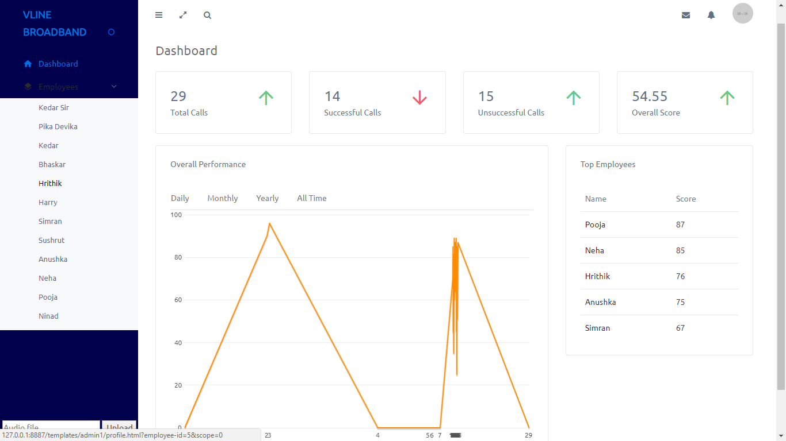
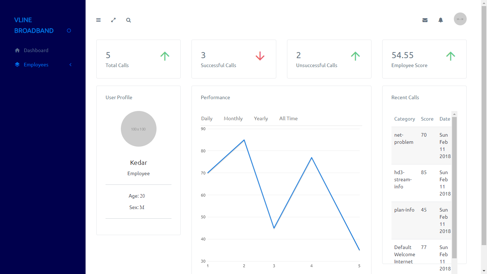
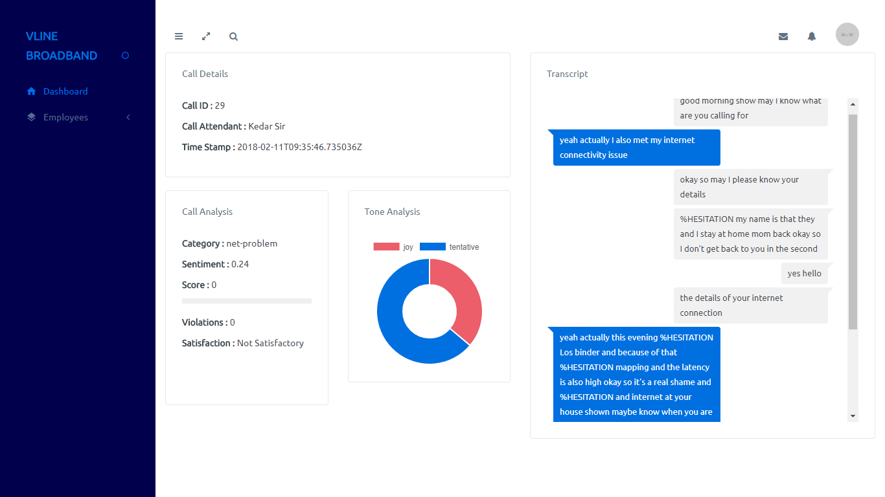

# call-center-automation
 A platform to categorize, score and check violations of calls in a call center and analyze employee productivity
 
### Description
The calls in the call center are recorded and uploaded to the server. The audio file (call) is converted to text and the speeches of speakers (employee and caller) are sperated. Following operations are carried out
1. Detect category and intent of the call (Eg. Complaint, Plan Inquiry, etc.)
1. Detect overall sentiment of the call
1. Check for any violations (Eg. Abusive language)
1. Based on the above, assign overall score to the call
1. Show all of above in a interactive dashboard to check check overall effectiveness of an employee

Additionally, created a Progress Web App (PWA), that had a chat bot integrated with it so that people could solve their trivial queries using the chatbot instead of calling the call center.

### Screenshots

### Installation
git clone https://github.com/bhaskar337/call-center-automation.git

cd email-bot/email-bot

pip install -r requirements.text

### To Run
#### Django Server
python manage.py runserver

#### Front-end 
/front-end/templates/admin1/index.html

### Build With
1. Django (Django-rest-framework)
1. Jquery + Chart.js
1. DialogFlow
1. IBM Watson
